# Cycling World

Cycling World website is a  site for people who are looking to purchase bikes. This site offers 3 diffrent styles of bikes with a small selection of bikes in each section. 

This site will be treated as a stepping stone for people who wish to upgrade their bike from a lower end to a bike that is of better quality and better comfort

- Live link: <a href="https://nowickilukasz.github.io/bike-styles/index.html">Cycling World</a>

# User Exparience (UX)

## User Stories

###   First Time Visitor Goals
- As a first time visitor, I want to be able to understand what s the purpose of the site.
    - Home page consists of a hero image which paints a subject of the page. 
    Each subsequent section for bikes has a relative cover image to allow to visualise what the page is meant for. 
    - Navigation area, displays main points of the site and allows to go to the links easily. 
    - There are videos of bikes and their styles, to allow the user to see what type of biking they might wish to do.

- As a first time visitor, the navigation should be easy to use.
    - Site is easy to navigate due to the header area with clean links to other pages. 
    - If the user wishes to contact us, we include a contact section and social media links.

- As a first time visitor, I want to ensure that each bike has a description of specifications that advise on the quality of the bike.
    - Each bike has a photo and specifications of the main components that potential buyers may look for. 
    - Each bike has a link to a site that allows the user to a new tab to look to buy a bike and to further look as the specifications. 

### Returning Vistor Goals
- As a returning visitor, I want to find an easy way to get in contact with the site.
    - Contact us section is clearly labeled to allow for navigation.
    - Contact form is easily readable and fillable.
    - Contacting the site may be done through the form or or throught social media links. 
    - Each social media link is able to open in a new tab which allows the user to easily navigate back to our site.

### Frequent Visitor Goals
- As a frequent user, I want the user to e able to check if any new bikes have been updated.
    - The user may browse through each bike section to find bikes that are recommended.
    - The layout of the pages is consistant for easy navigation with links staying consistent in the header area.

# Design

## Color Scheme
- There are 5 colors used:
    - White: #fafafa
    - Black: #000000
    - Aqua: #00ffff
    - Silver: #c0c0c0c
    - Brown: rgb(130,87,34)

## Typography
- The PT Serif font is used throughout the entirety of the webpages. The back us font is a serif in the event of the PT serif font not being recognised by some browsers. 
    
## Imagery
- The site uses multiple images thoughout. 

    - The hero image on the home page shows that the page is dedicated to bikes. 
    - There are sections dedicated to types of bikes, road and off road. Each heading image identifies what page you are on with a related image. 
    - Within each section, there is a collection of images showing bikes to entice visitors to find out more about them and allowing them to picture the bike before deciding to research further. 

# Features 
- Responsive on all device sizes
    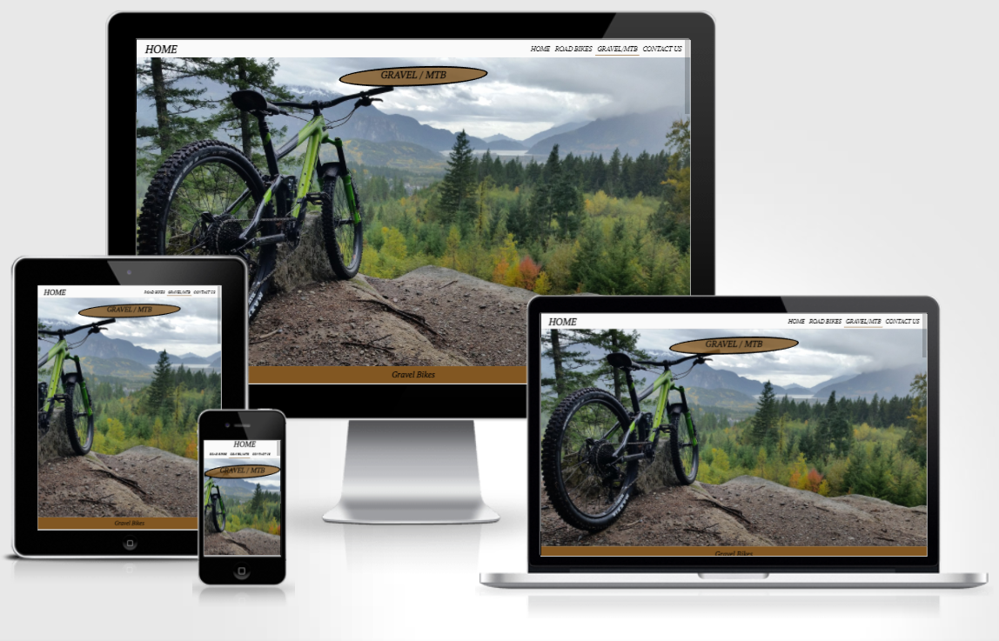

- Interactive links and videos.

- Inteactive form.

# Technologies Used

## Languages Used
- [HTML5](https://en.wikipedia.org/wiki/HTML5)
-   [CSS3](https://en.wikipedia.org/wiki/Cascading_Style_Sheets)

## Libraries and Programs Used
- [GitHub](https://github.com/)
        - A platform to store program files online using a verion controlled system. 
- [GitPod](https://www.gitpod.io/)
        - An program used to write code into, which then can sync with GitHub to allow for cloud storage of your work. 
- [Google Fonts](https://fonts.google.com/)
        -Google fonts was used to insert PT Serif font into the stying sheet. 
- [Balsamiq](https://balsamiq.com/)
        - A program designed to allow to visualise a site by the use of wireframes
# Existing Features
- Navigation Bar
    - The navigation bar is located on all pages, it is fully responsive with link including, Home, Road, MTB/Gravel and a Contact Us.
    - Focus of this part is to allow users to easily navigate though all the pages.
        <h2 align="center">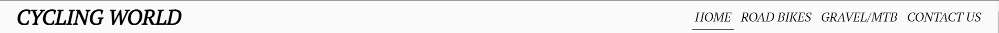
- Hero image
    - This section welcomes the user to the site. 
        <h2 align="center">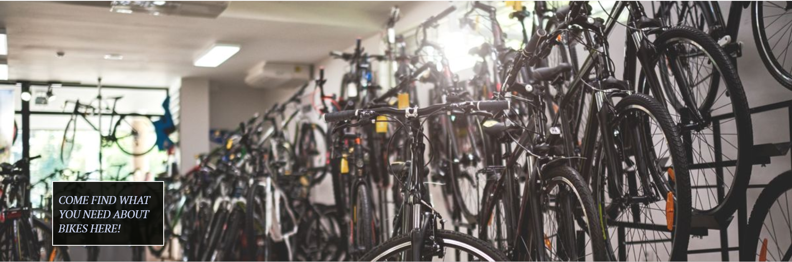    
- Videos
    - This videos section allows the user to see what is the difference between the 3 types of bikes and allows the user to follow later into the bike section.
        <h2 align="center">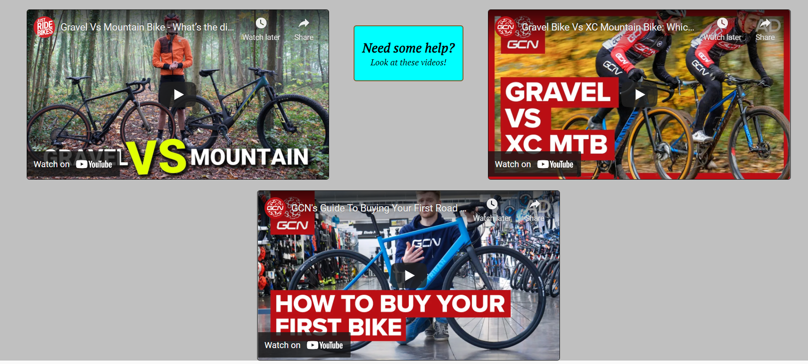 

- Road/MTB/Gravel bikes pages
    - This section allows the users to browse through the selection of bikes in order to loot at their specifications and llows them to go to the site where they can buy them.
        <h2 align="center">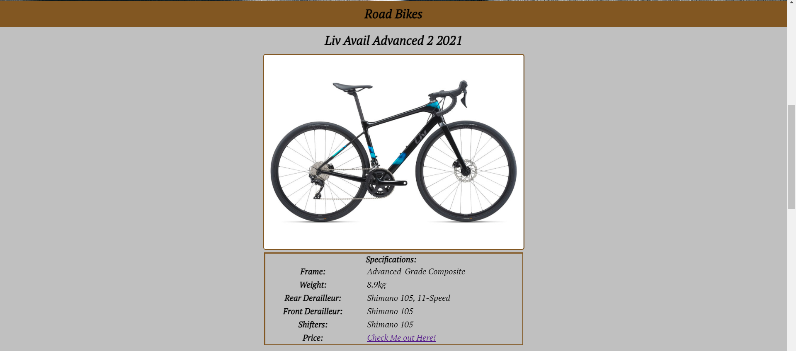
        <h2 align="center">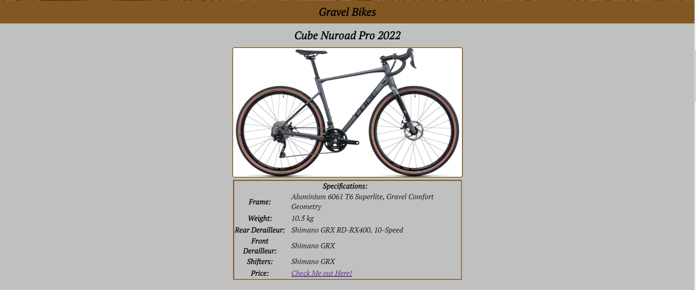
    
- Sign Up Page
    - This section allows the user to get in touch with, and allows the user to select the types of bikes they are intersted in. This will allow the page in the future to be updated with more requested styles of bikes. 
        <h2 align="center">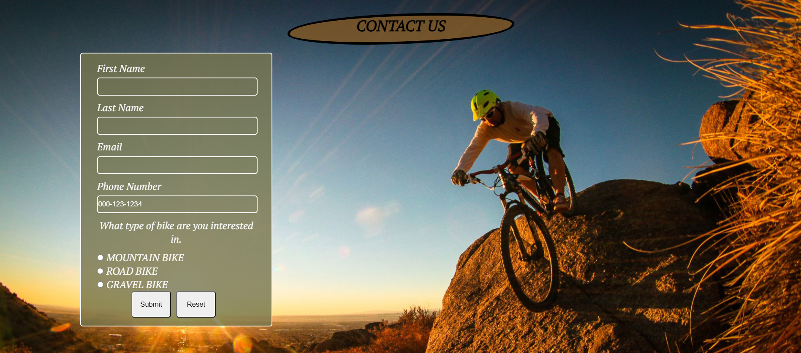

- Footer 
    - This section allows the user to go onto social media platforms to get in touch, or to look at news updates. 
    - Links provided are for: Facebook, Twitter and Instagram. 
        <h2 align="center">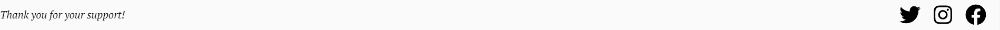

# Testing
## Balsamiq

The Program balsamiq was used to visualise the layout of the site. Here are the plans:

<h2>Index page:</h2>
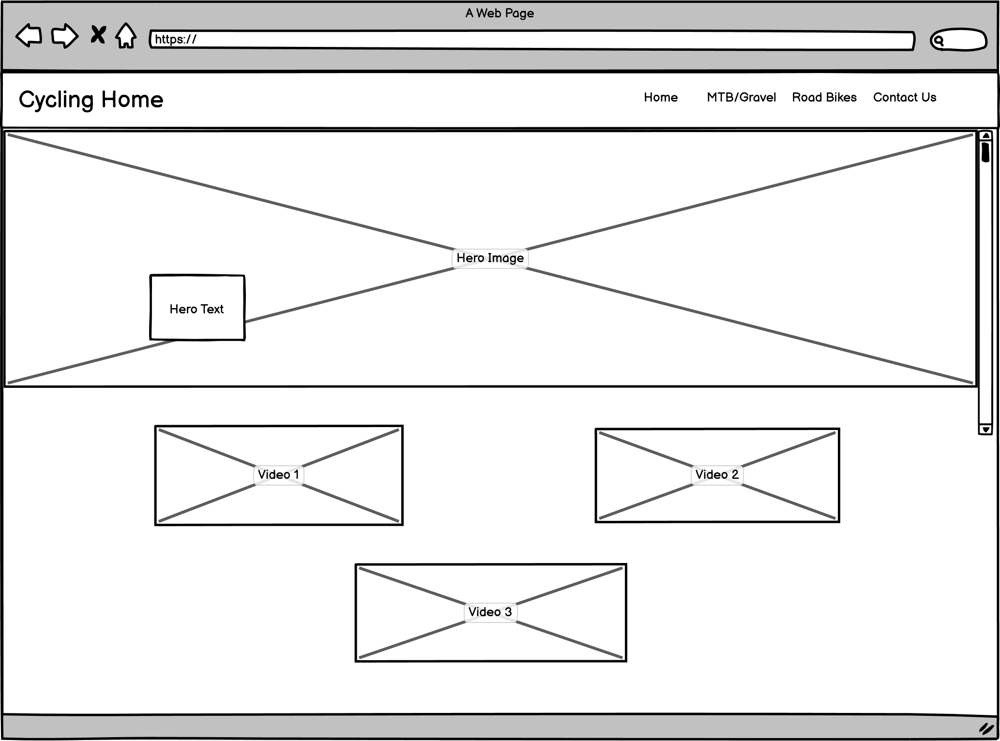
<h2>Main contents page:</h2>
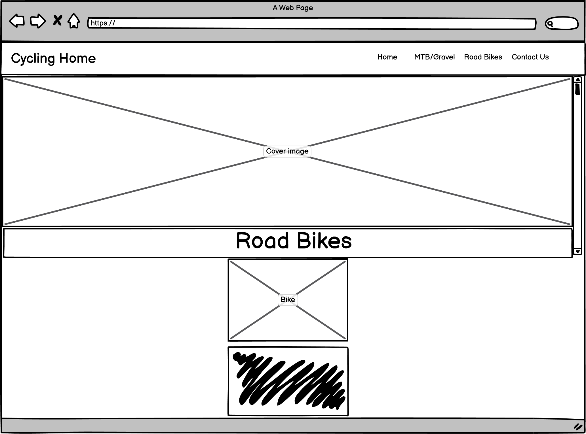
<h2>Form page:</h2>
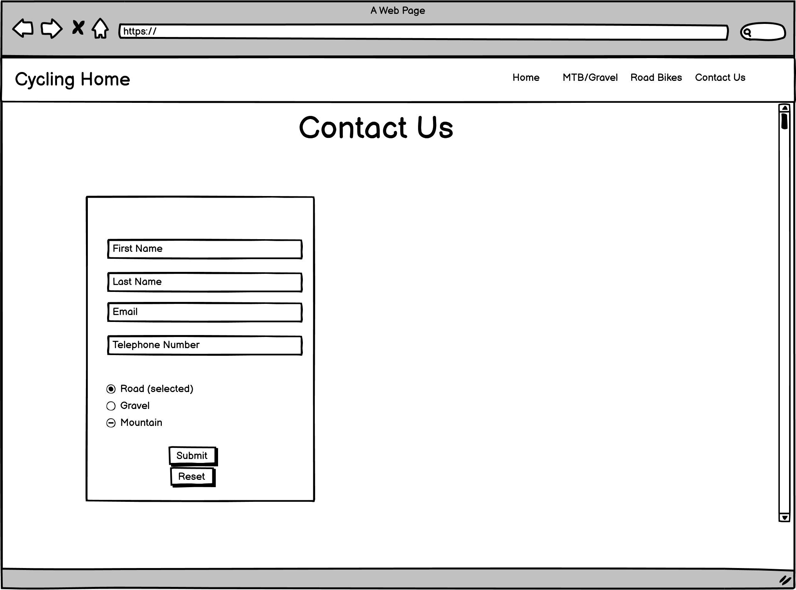

## The Website has been tested on the following browsers:
    - Google Chrome
    - Edge Browser
    - Opera Browser
    - Mozzilla Browser

## Lighthouse Report

The site has been put through "Lighthouse" to produce a report on the performance. Each report was ran through incognito mode to show true performace without the periferal acions on the browser. 
 

- Desktop
<h2>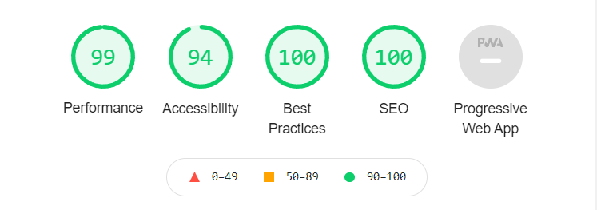</h2>

- Mobile
<h2>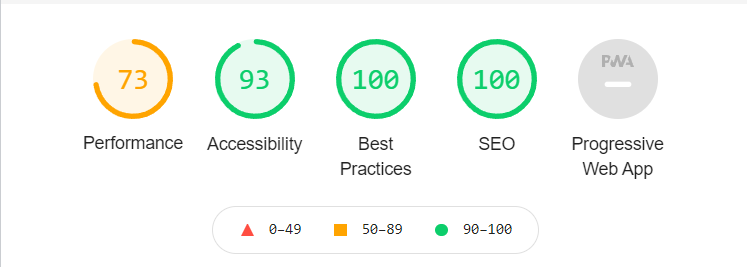</h2>
- Validation
    - CSS
    <h2><a href="http://jigsaw.w3.org/css-validator/check/referer">
        </h2>
    </a>
    - HTML
    
No errors or warnings to show. 

# Known Bugs

- The "active" class used to underline active pages in the navigation bar does not activate in the edge browser.

# Deployment
## GitHub Pages
The project was deployed to GitHub Pages.

To allow the page to be deployed we followed the following steps.

1. Log in to GitHub and locate the repository required.
2. Find the "Settings" Button on the menu.
3. Find the "GitHub Pages" Section on the left side as you scroll down.
4. Under "Source", click the dropdown called "None" and select "Main Branch" and save.
5. This will create a link to the now published site. 
The site may take a few minutes to fully publish.

## Credits

### Content
- Content has been written by the author.
- Specifications of bikes have been taken from the respective sites linked in each hyperlink.

### Researched Code
-  Researched Code
    - <a href="https://stackoverflow.com/questions/2939914/how-do-i-vertically-align-text-in-a-div/13515693#13515693">Code to center vertically</a>
    - <a href="https://coder-coder.com/how-to-center-button-with-html-css/">Center submit and reset buttons </a>
    - <a href="https://www.w3schools.com/cssref/sel_placeholder.asp">Placeholder styling</a>

### Media
#### Videos were taken from YouTube:
Links are as follows:
- <a href="https://youtu.be/7cmUfhhWDEc">Video 1</a>
- <a href="https://youtu.be/PvYFzKjdGmU">Video 2</a>
- <a href="https://youtu.be/_T7NTe3uBN4">Video 3</a>

#### Images were taken from multiple sources:
- Google Images
- <a href="https://dublin2bike.ie/">Bike Images</a>

### Acknowledgement

- I would like to thank my mentor for helping me with this project and the support from the Code Institute.